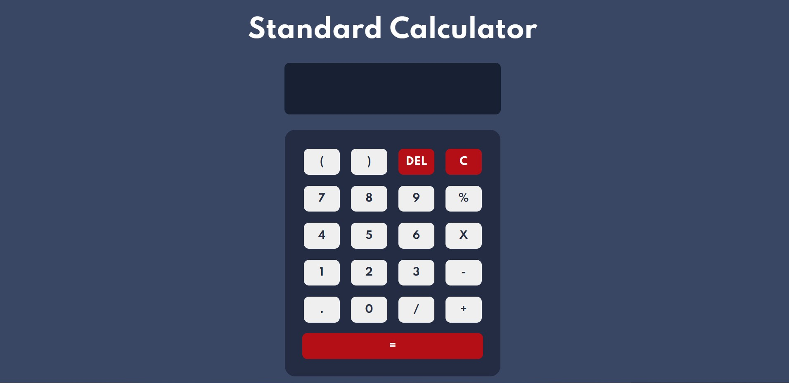

# Calculator app solution

## Table of contents

- [Overview](#overview)
  - [The challenge](#the-challenge)
  - [Screenshot](#screenshot)
  - [Link](#Link)
- [My process](#my-process)
  - [Built with](#built-with)
  - [What I learned](#what-i-learned)
  - [Continued development](#continued-development)
  - [Useful resources](#useful-resources)
- [Author](#author)

**Note: Delete this note and update the table of contents based on what sections you keep.**

## Overview

### The challenge

Using HTLM, CSS and Javascript to create a calculator according to the design given in the design folder

### Screenshot

### Link

- Solution URL : [https://github.com/Anish010/Calculator-App]
- Live Site URL : [https://anish-standard-calculator.netlify.app/]

## My process

### Built with

- Semantic HTML5 markup
- CSS custom properties
- Google Fonts
- Javascript

### What I learned

With the help of this project i able to practice my CSS ,HTML skills and basic javascript DOM skills very well. I also came to know about some new properties and new ways to design a web page.

## Author

- Linkedin - [Anish Kumar Mohanty](https://www.linkedin.com/in/anish-kumar-mohanty-68a019216/)
- Instagram - [@anish.mohanty\_](https://www.instagram.com/anish.mohanty_/)
